# Exercise 1.01: Getting started

## 1. Create an application that generates a random string on startup, stores this string into memory, and outputs it every 5 seconds with a timestamp.

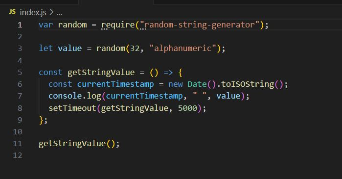

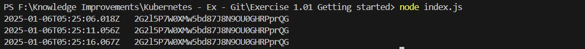

## 2. Deploy it into your Kubernetes cluster and confirm that it's running with kubectl logs ...

## You will keep building this application in the future exercises. This application will be called "Log output".

1. create a k3d cluster : "k3d cluster create -a 2"

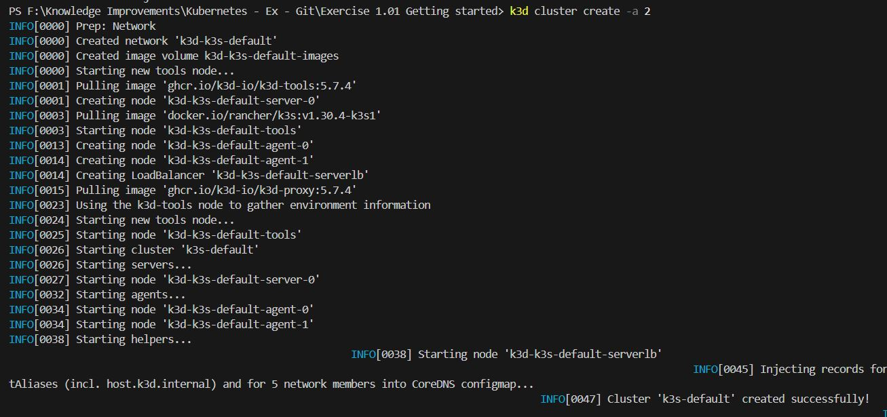

2. Generate the docker file to create a docker image.

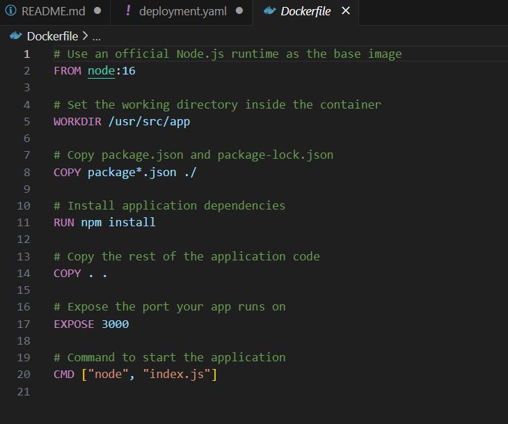

3. build docker image for the "Log output" (This image is called "logger-dep")

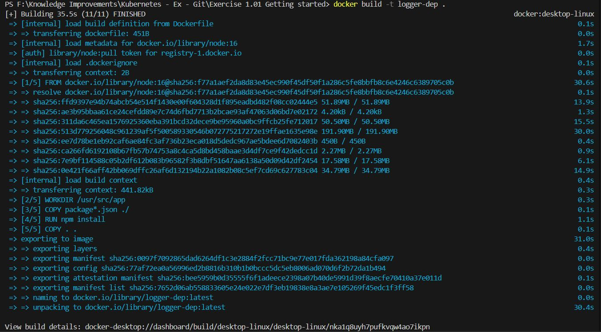

4. Need to tag username to docker image before push it "docker tag logger-dep rashmika31601/logger:v1.0"

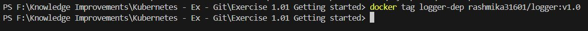

5. Login to docker "docker login"

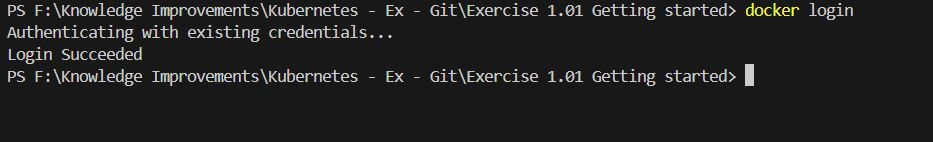

6. Push the docker image to docker, "docker push rashmika31601/logger:v1.0" (Since I've done this previously and there are some files left some layers are already exits )

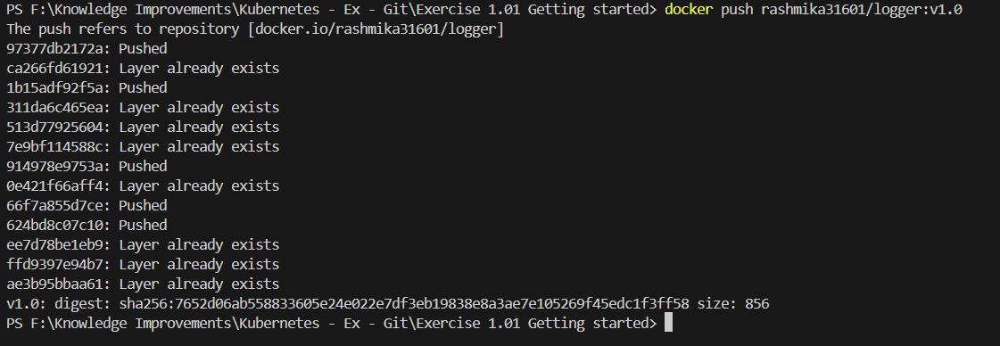

7. we can see the docker images by "docker images" command

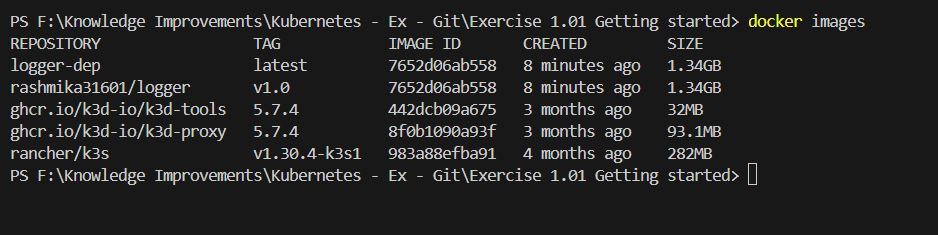

8. Update the deployment.yaml file under the manifest folder.

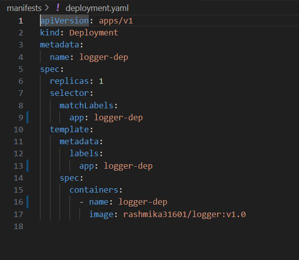

9. Create a kubectl deployment. The name must be one word and it should start with simple letters. To start deployment run "kubectl create deployment logger-dep --image=rashmika31601/logger:v1.0".

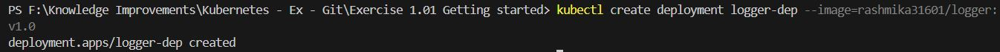

10. "kubectl get pods" will show the current deployment status.

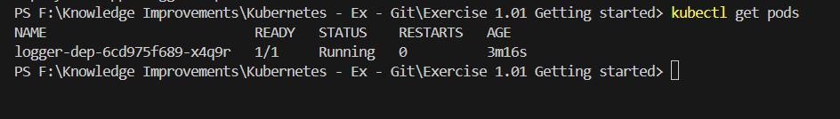

11. "kubectl logs -f logger-dep-6cd975f689-x4q9r" will show the logger output.

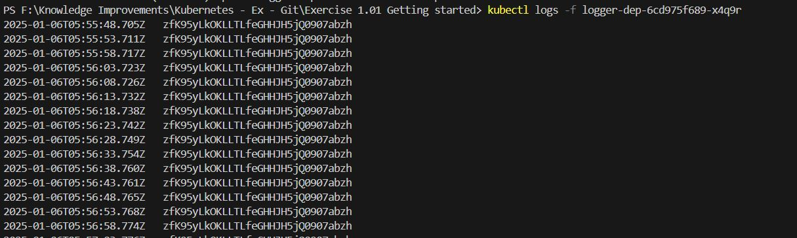
