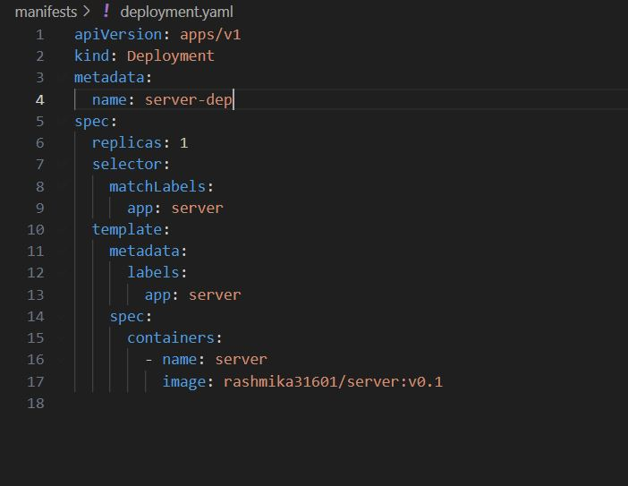

# Exercise 1.02: Project v0.1

## Create a web server that outputs "Server started in port NNNN" when it is started and deploy it into your Kubernetes cluster. Please make it so that an environment variable PORT can be used to choose that port. You will not have access to the port when it is running in Kubernetes yet. We will configure the access when we get to networking.

1. Generate the server function using nodejs

2. Update the Docker file.

3. Run the command "docker build -t server ." to generate the docker image

4. Tag the docker name and version "docker tag server rashmika31601/server:v0.1"

5. Update the manifest folder deployment yaml file, The image name and app name must corrected,

6. Login to docker "docker login".

7. Push the docker image to docker, "docker push rashmika31601/server:v0.1"

8. Create a kubectl deployment. To start deployment run "kubectl create deployment server-dep --image=rashmika31601/server:v1.0".

9. Check the pods, kubectl get pods

10. Use following commands to delete or apply yaml config, (The cluster might not work properly if config is incorrect)
    kubectl delete deployment server-dep
    kubectl apply -f manifests/deployment.yaml

11. Use "kubectl logs -f server-dep-c4b64db94-8ldrh" to see the response

