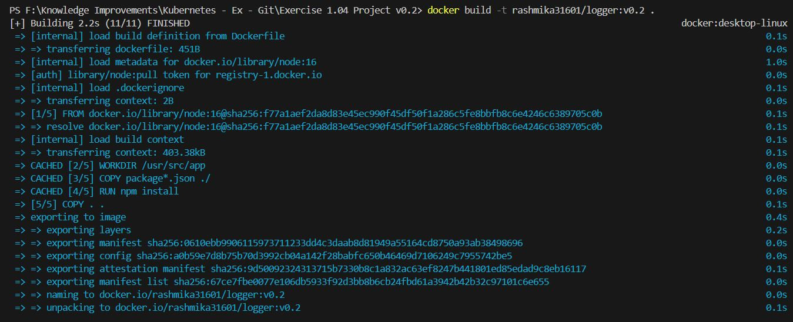
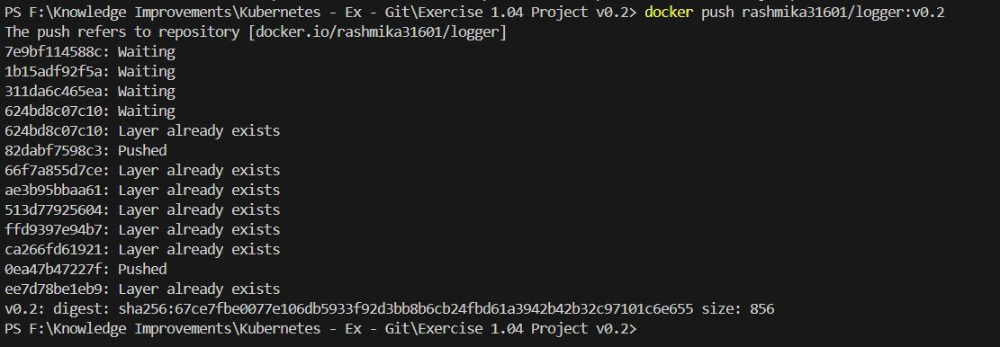
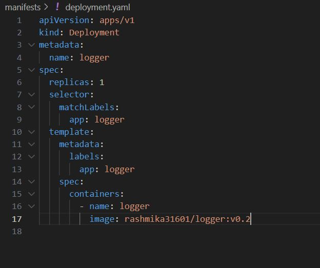
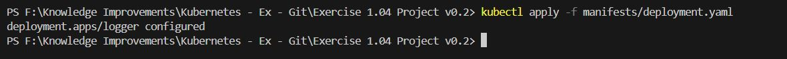

# Exercise 1.04: Project v0.2

## Create a deployment.yaml for the project. You won't have access to the port yet but that'll come soon.

1. Build the docker image again "docker build -t <image>:<new_tag> ."
   docker build -t rashmika31601/logger:v0.1 .

2. Push the updated build : docker push <image>:<new_tag>
   docker push rashmika31601/logger:v0.1

3. Then edit deployment.yaml so that the tag is updated to the <new_tag> and run the following command

4. Apply the yaml to cluster "kubectl apply -f manifests/deployment.yaml".

