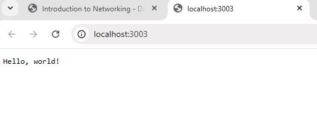

# Exercise 1.05 Project v0.3

## Have the project respond something to a GET request sent to the project. A simple html page is good or you can deploy something more complex like a single-page-application.

## See here how you can define environment variables for containers.

## Use kubectl port-forward to confirm that the project is accessible and works in the cluster by using a browser to access the project.

1. Start the docker engine

2. Create a cluster

- k3d cluster create -a 2

3. Create a program that respond to html request (The below program will response Hello World in html)

4. Build the docker image

- docker build -t rashmika31601/server-dep:v0.1 .

4. Push the docker image

- docker push rashmika31601/server-dep:v0.1

5. Create Kubectl deployment using manifest config

- kubectl apply -f manifests/deployment.yaml

6. Check the pods are up and running

- kubectl get pods

6. Set the port to http://localhost:3003/

- kubectl port-forward server-dep-c4b64db94-f9tc4 3003:3000

7. Go to http://localhost:3003/ and check the response

8. If need to re apply the changes on deployment.yaml do following,

   - kubectl delete deployment server-dep
   - kubectl apply -f manifests/deployment.yaml
